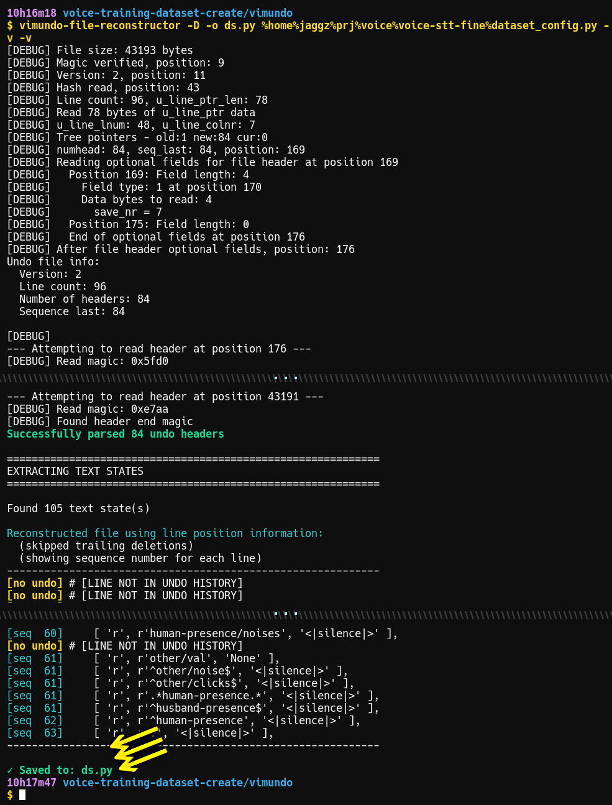

# vimundo-file-reconstructor

Vim Undo File Parser - Recover files from .un~ files.

```
usage: vimundo-file-reconstructor [-h] [-o FILE] [-v] [-a]
        [--hex-dump OFFSET LENGTH] [-X N] [-D]
        [--forensic] [--explain] [undo_file]
```

<div align="center">
  <br>
  <em>Claude "excited" after it saw my successful run...</em><br>
</div>

## Why!?

If you're here, you probably know why.
It's quite likely I should say I'm sorry for your loss.

In my case, *after filesystem corruption I lost a lot of my work*, including
getting corruption **in my git repositories**. HOWEVER, ***I have `undodir` set for
persistent undo files***.

*This utility can possibly reconstruct some or all of your file(s) from your vimundo.*

Note: In the past I would do `strings myundofile` and reconstruct the file by hand from
the contents; and it's worth a first shot for you to get a copy of the text you can
extract with `strings`. However, by parsing vimundo files we have the benefit of the line
numbers, timestamps, etc. I've needed such a utility, off and on, for years, but
now I can just provide an LLM Vim's `undo.c`, and it'll figure out the structures,
and with a lot of working together, including my own guidance and solutions to
problems, and after several hours of working with **claude.ai** over a couple days,
I was able to recover most of my lost contents of a project. My "backup" was my git
repo, which was corrupt, and the backup of my repos too old.

### Finally

*Claude and I are apparently happy to present to you `vimundo-file-reconstructor`*

*(Note: You might have 'undodir' set in your .vimrc, in which case vim stores
files there, using full paths with slashes replaced by % characters.
(In vim, see ":set undodir?" to see if vim is using that alternate
location)*

### Limitations

**Missing content**:
First off, vim's undo history stores *changes* ("deltas"), not a copy of your
file + all changes. Nevertheless, various factors come into play: For
instance, a new vim session, newly-enabled vimundo, or even if you edit a file
outside of vim (where the file-contents hash won't match), vim will start a
fresh vimundo history. You might have `undolevels` set, limiting what's stored, or
you might have moved your file and continued editing.  In any case, for a
variety of reasons, earlier contents might NOT appear in the undo history.

And, as an example of what's stored, if you have some text in your file
and have a fresh vimundo history, that text will only be stored in vimundo when
it's removed/changed because, again, vim only stores changes (deltas).

<div align="center">
  <em>An actual run (cropped)...</em><br>
  <br>
</div>

### Usage:

```
Vim Undo File Parser - Recover files from .un~ files.

usage: vimundo-file-reconstructor [-h] [-o FILE] [-v] [-a]
                                  [--hex-dump OFFSET LENGTH] [-X N] [-D]
                                  [--forensic] [--explain]
                                  [undo_file]
positional arguments:
  undo_file             Path to Vim undo file (.un~)

options:
  -h, --help            show this help message and exit
  -o, --output FILE     Save recovered text to FILE
  -v, --verbose         Enable verbose debug output
  -a, --show-all        Show all text states, not just the latest (! DISPLAY
                        MODE ONLY !)
  --hex-dump OFFSET LENGTH
                        Dump hex at OFFSET for LENGTH bytes (debug mode)
  -X, --skip-last N     Skip the last N undo operations (useful if last
                        changes were deletions)
  -D, --skip-deletions  Skip trailing deletion-only operations at the end
  --forensic, --all-versions
                        Forensic mode: Output ALL versions of each line,
                        sorted by line number then time
  --explain             Show educational information about Vim undo file
                        structure and exit

Examples:
  vimundo-file-reconstructor file.py.un~
  vimundo-file-reconstructor file.py.un~ -o recovered.py
  vimundo-file-reconstructor file.py.un~ -o recovered.py -v
  vimundo-file-reconstructor file.py.un~ --show-all
  vimundo-file-reconstructor file.py.un~ --explain

```


